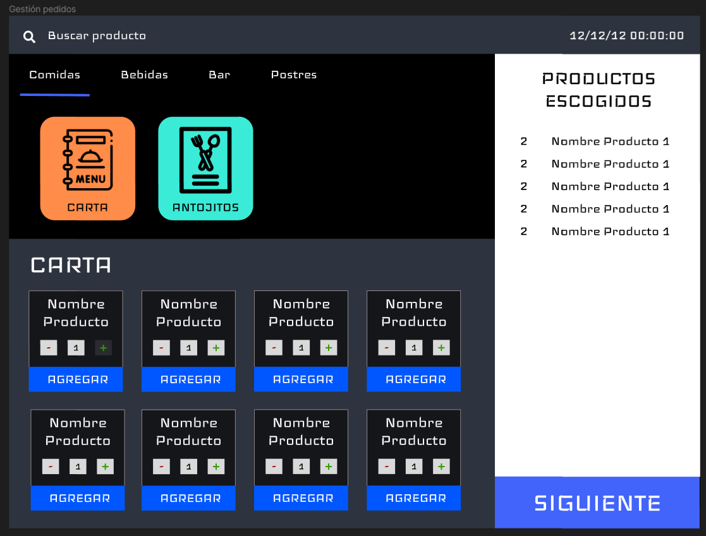
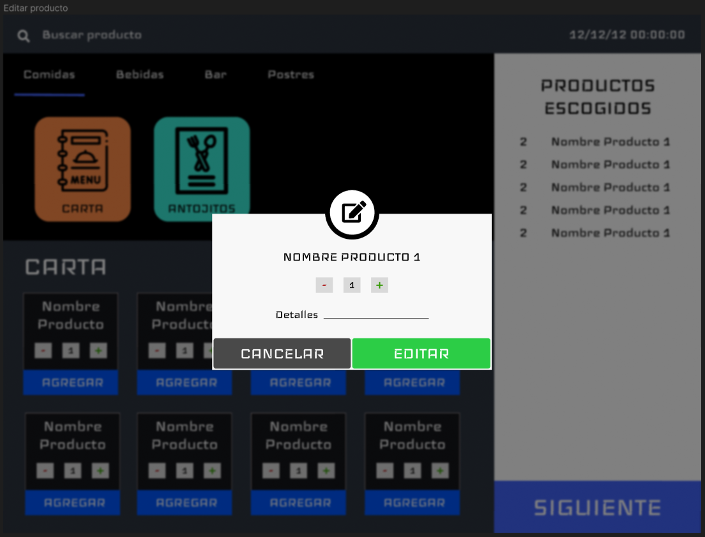
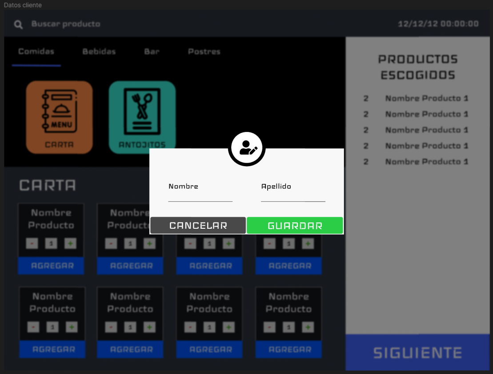
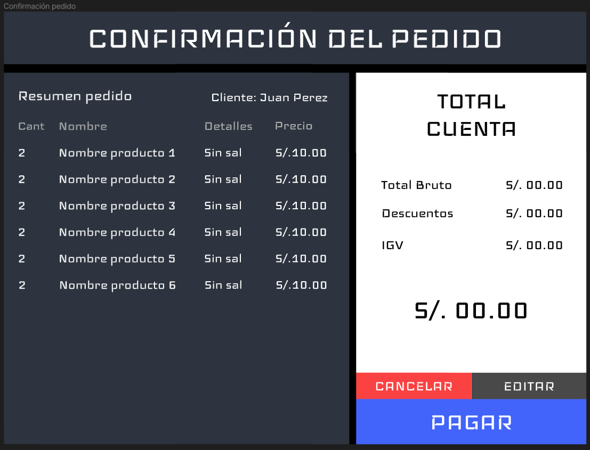
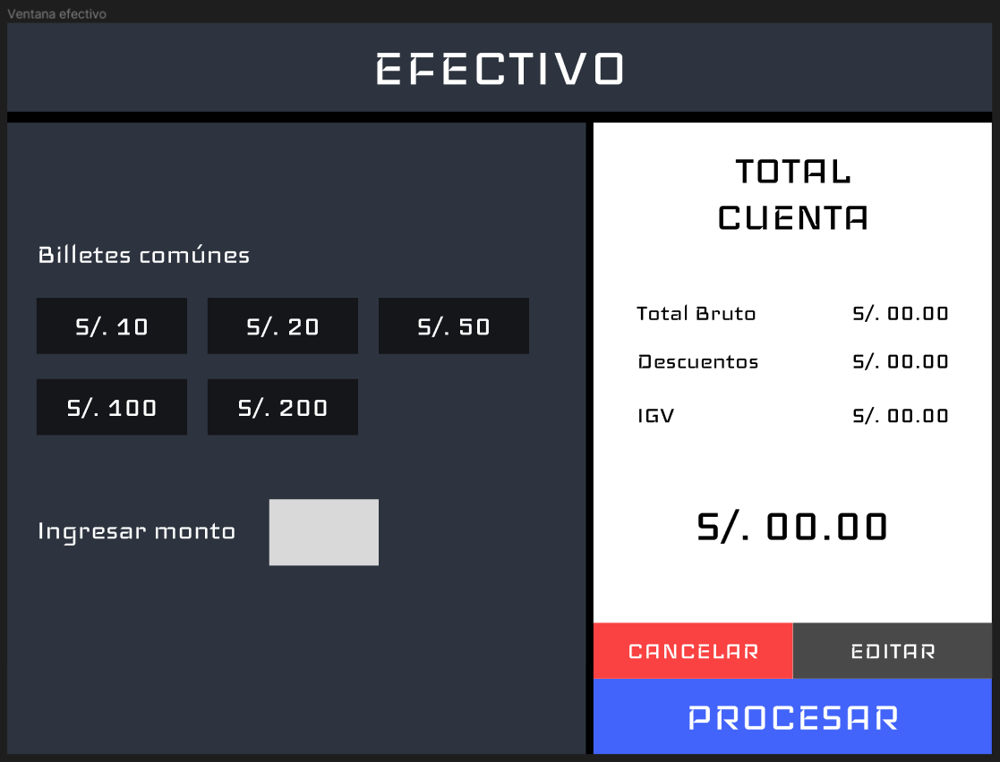
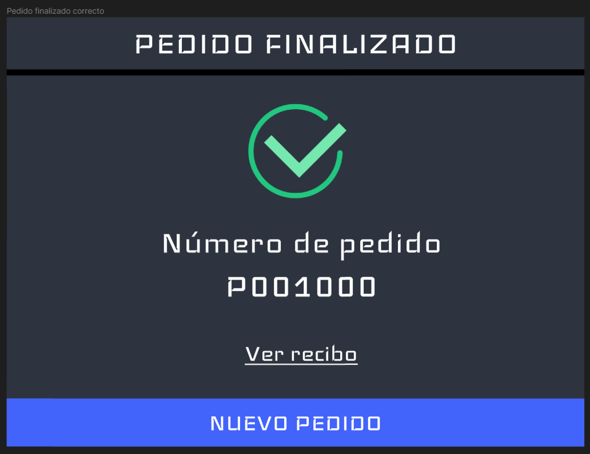
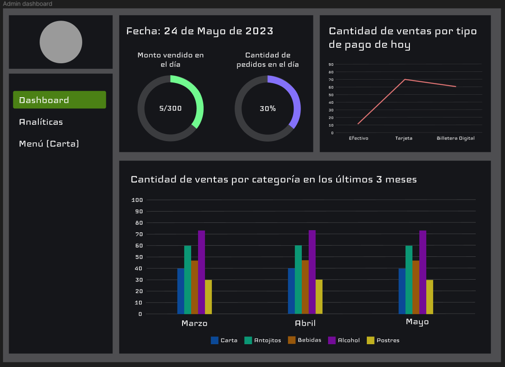
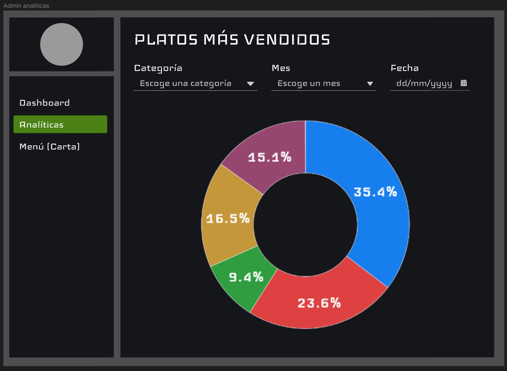
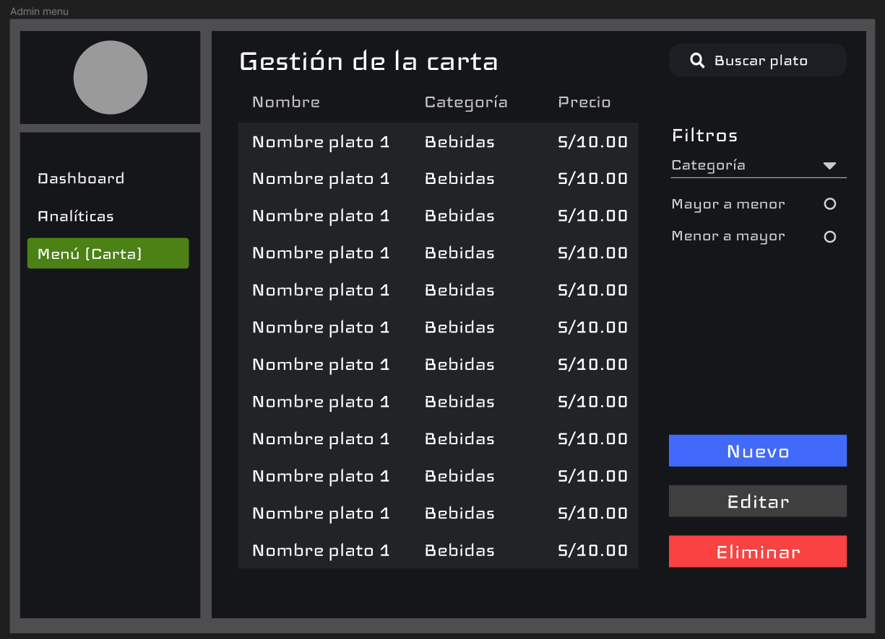

# Sistema de punto de venta y gestión administrativa para restaurante La Cochera
Este proyecto es una aplicación de punto de venta y gestión administrativa para el restaurante La Cochera desarrollada en Java Swing.

## Descripción general
La aplicación sigue el patrón de arquitectura de software Modelo-Vista-Controlador (MVC) y tiene un enfoque orientado a objetos. La aplicación consta de 2 partes principales:

- Punto de venta (POS): Es la parte de la aplicación que se utiliza para registrar las ventas y generar los tickets de venta. Esta parte de la aplicación está diseñada para ser utilizada por los empleados del restaurante.
- Panel de administración: Es la parte de la aplicación que se utiliza para gestionar los platos y ver los reportes de las ventas. Esta parte de la aplicación está diseñada para ser utilizada por el administrador del restaurante.

##  Requisitos
Java (versión 17 o superior)

## Vistas de la aplicación
Quizás algunos diseños no concuerden con los realizados en la aplicación final, ya que se han realizado algunos cambios mínimos en el diseño de la aplicación, pero la idea general es la misma.

### Punto de venta

### Página de administración:

##  Instalación
1. Clona este repositorio
2. Dirígete a src/main/java/
3. Ejecuta "LaCocheraPOSApplication.java" para iniciar la aplicación

## Uso
En construcción...